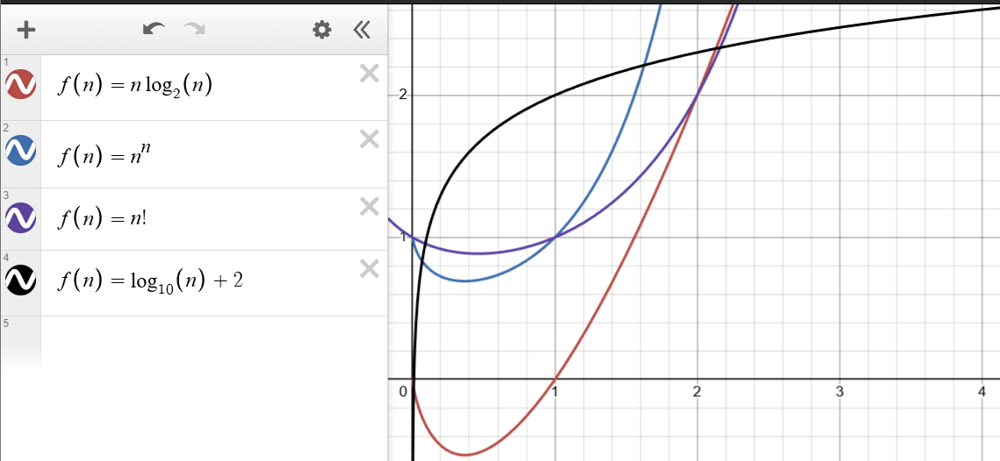
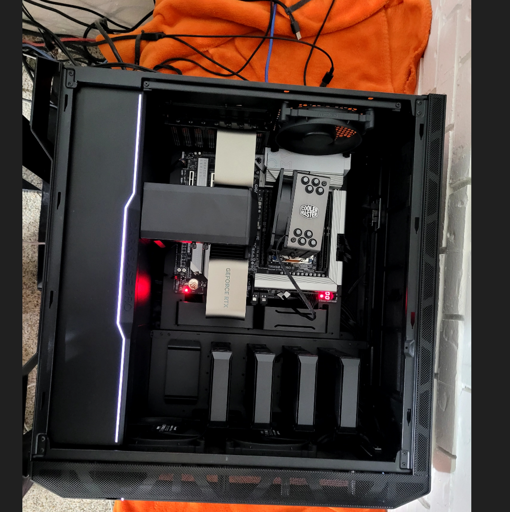
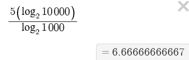

# Theory vs. Practice

- List 3 reasons why asymptotic analysis may be misleading with respect to
  actual performance in practice.

1. At low values of n asymptoticly worse functions may outpreform an otherwise asymptoticly superior version.
There are many reasons for this but most simplyput look at the graphs of different functions:

some functions start slow and scale up fast, others start fast and end up slow. In the real world you can have much more complex functions aswell. 

2. asymptotic complexity does not factor in external factors such as cashe misses, the temperature of the air, hardware accelarators and so on.
our program's fisrt run at 1000 elements warmed up the CPU to an extent where it is underclocing to keep itself safe, this only happend because-
you never clean your computer + your running a 350W threadripper with a stock cooler resting naked held securely by gravity ontop of your cpu. 
Now that the scene has been set, your seccond script, this time running a larger test of 10,000 elements, loads into memory. But tragicly it overflows into
the swapfile! (as we only put 1 stick of 2 gb ram in our system...) The 50mb floppy disk we use as our prefered swapfile location is just enough to 
pick up the slack and 100 secconds later after HARD but severely throttled number crunching (mostly disk reads) we calculate our final answer... 42!

3. If we always ignore constant factors and mostly care about leading terms, then they can add up and lead to a significant discrepancy in our runtime.

- Suppose finding a particular element in a binary search tree with 1,000
  elements takes 5 seconds. Given what you know about the asymptotic complexity
  of search in a binary search tree, how long would you guess finding the same
  element in a search tree with 10,000 elements takes? Explain your reasoning.

i would say that the worst case would take:

6.6666 secconds

reasoning: i set it up like ratio and solved for the missing variable. I assumed that-
the scaling holdes and that there are no other variables affecting the runtime, ANd ig that it was the worst case i was calculating.
I am assuming the complexity of the function to be the same as a properly balanced search tree where we cut the search space in half at each node.

- You measure the time with 10,000 elements and it takes 100 seconds! List 3
  reasons why this could be the case, given that reasoning with the asymptotic
  complexity suggests a different time.

1. reason: binary search trees arnt alwasy balanced. What i was trying to say was that
trees have a best case of log(n) and a worst case of n. The realworld runtime for a real 
data set is likely inbetween these two bounds if the dataset is not structured properly. in this case sorted.

in my last responce i tried to talk about how the small input of 1,000 was shifting though around 200 elements
a second, while the 10,000 was only doing 100. This means to me that the small input was not properly balanced
because it should have been 500 elements the first second, 250 the 2nd, 125, the third second and so on. The bigger 
input however is the real issue, because i would have expected it to be 5,000 elements disregarded during the first 
second, 2,500 in the second, and 1,250 the third... but we only saw an average of 100... thats really bad.
So my point is that the 2nd input is a REALLY bad tree while the first one is only a pretty bad tree.

2. What if we ran out of cashe or even worse we ran out of ram entirly-
and had to use the swap file, this could lead to horrible run times. Again this would have an effect-
on smaller values of n, my point is what if somewhere between 1,000 and 10,000 we run out of ram and have to start pulling from our disk's-
swapfile. now because we are running a floppy disk in 2025 we find that it took 100 seconds to preform the task.

3. There was another program running on the system that bogged down the preformance. The program in question was windows update-
it started just as our larger 10,000 element input started and took up 98% of our cpu time.

Add your answers to this markdown file.

I certify that I have listed all sources used to complete this exercise, including the use of any Large Language Models. All of the work is my own, except where stated otherwise. I am aware that plagiarism carries severe penalties and that if plagiarism is suspected, charges may be filed against me without prior notice.